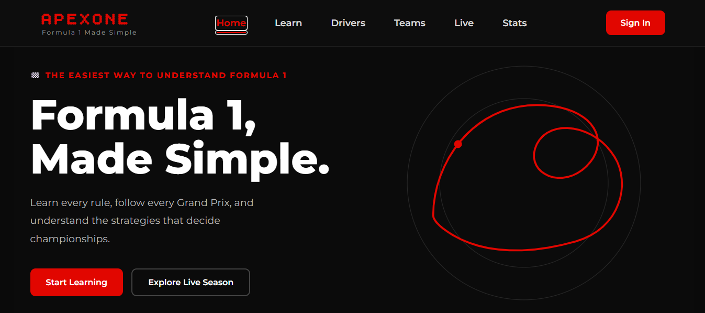
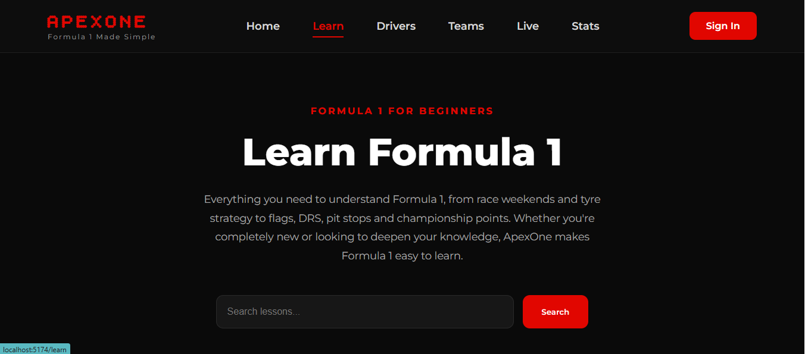

# ApexOne

> **Formula 1, Made Simple.**

ApexOne is a modern React web application designed to help beginners understand Formula 1 through interactive lessons, visual explanations, quizzes, and (coming soon) live race data.

---

## Preview

### Home Page



### Learn Page



---

## Features

- Beginner-friendly Formula 1 lessons
- Interactive learning experience
- Quick quizzes after lessons
- Clean, reusable React components
- Modern dark theme inspired by Formula 1
- Responsive design
- Lesson search
- Built with React + Vite

---

## Current Lessons

- Race Weekend
- Tyres
- DRS
- Pit Stops

### Coming Soon

- Flags
- Safety Car
- Qualifying
- Driver Championship
- Constructor Championship
- Formula 1 Strategy
- Interactive Quizzes
- User Progress Tracking
- Live Driver Standings
- Live Constructor Standings
- Race Calendar
- Circuit Explorer

---

## Tech Stack

- React
- Vite
- React Router
- JavaScript (ES6+)
- CSS3
- HTML5

---

## Project Structure

```text
src
│
├── assets
│   ├── images
│   └── svg
│
├── components
│   ├── Navbar
│   ├── Hero
│   ├── BeginnerEssentials
│   ├── DashboardPreview
│   ├── Footer
│   └── Cards
│
├── Pages
│   ├── Home
│   ├── Learn
│   ├── Drivers
│   ├── Teams
│   ├── Live
│   ├── Stats
│   └── About
│
├── App.jsx
└── main.jsx
```

---

## Getting Started

Clone the repository

```bash
git clone https://github.com/VIOLA895/ApexOne.git
```

Navigate into the project

```bash
cd ApexOne
```

Install dependencies

```bash
npm install
```

Start the development server

```bash
npm run dev
```

Open

```
http://localhost:5173
```

---

## Project Goals

ApexOne aims to make Formula 1 accessible to everyone by combining:

- Beginner-friendly explanations
- Beautiful UI
- Interactive learning
- Real Formula 1 data
- Modern web technologies

---

## Roadmap

### Phase 1

- React + Vite setup
- Routing
- Home Page
- Learn Page
- Beginner Essentials
- Responsive Navigation

### Phase 2

- Complete learning lessons
- Interactive quizzes
- Search improvements
- Animations

### Phase 3

- Formula 1 API integration
- Live standings
- Race schedule
- Team information
- Driver profiles

### Phase 4

- User authentication
- Progress tracking
- Saved lessons
- Achievements

---

## Contributing

Contributions, ideas, and feedback are welcome.

Feel free to fork the project and submit a pull request.

---

## Author

**Viola Kambuni**
 
GitHub: https://github.com/VIOLA895

---

## License

MIT License


